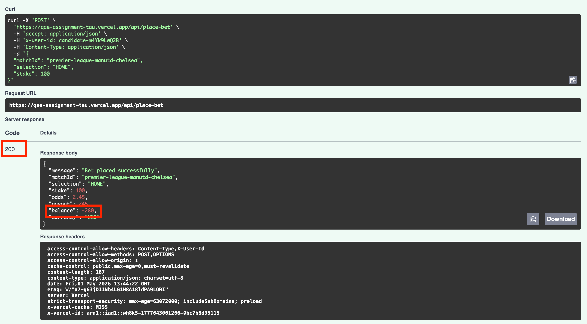
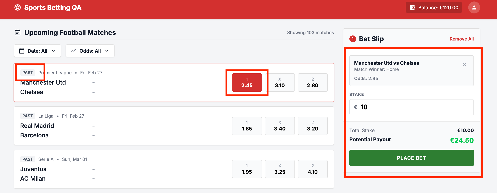
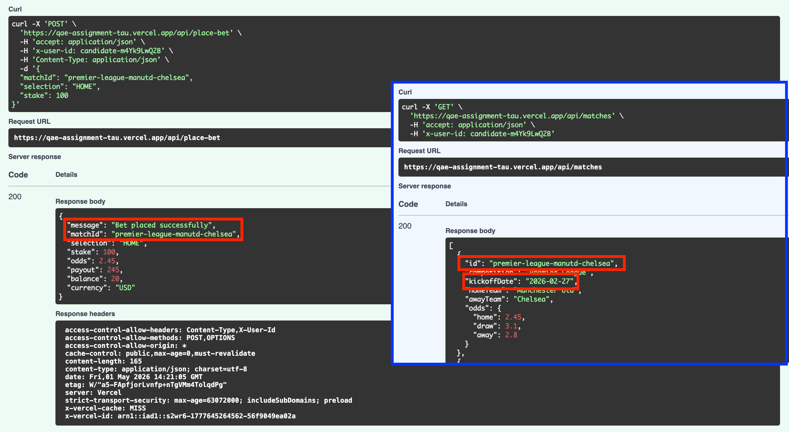
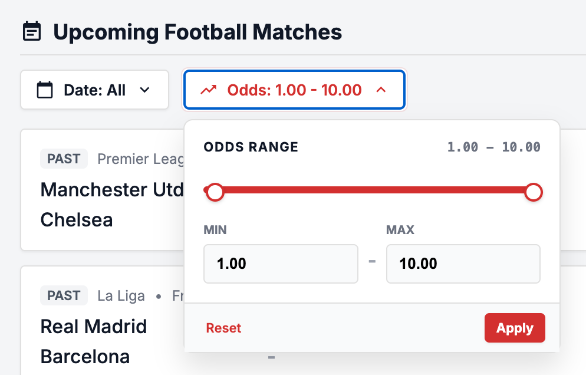
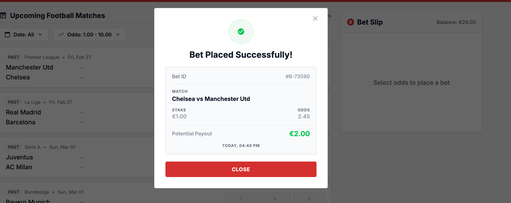

# Some found bugs

***
**ID:** B1\
**Title:** API - It's possible to put bet when no balance\
**Severity:** Critical\
**Preconditions:** User is authenticated. User has positive balance but less than 100.\
**Reproduction Steps:**
* Send POST request to https://qae-assignment-tau.vercel.app/api/place-bet with valid payload and "stake": 100. And check response.\
    Payload example:
    ```json
        {
          "matchId": "premier-league-manutd-chelsea",
          "selection": "HOME",
          "stake": 100
        }
    ```

**Actual Result:** 200 Status code. Bet placed successfully. The user has negative balance.\
**Expected Result:** 405 Status code with "Insufficient balance" error message should be in response\
**Business Impact:** Unlimited balance may cause crucial loss of companies money.\
**Evidence:**
  

***

**ID:** B2\
**Title:** It's possible to chose odds for finished matches\
**Severity:** Medium\
**Preconditions:** User is authenticated. The main page is opened.\
**Reproduction Steps:**
* Set "Date" filter to the time range in past and apply it
* Choose any match from the "Match List" and click on any "Odds" button.

**Actual Result:** The Odds button is enabled and "Place Bet" functionality appears in "Bet Slip" for finished event.\
**Expected Result:** #ToDo: To clarify requirements. Assumed expectations: The "Odds" button should be disabled for past events. "Bet Slip" should remain empty.\
**Business Impact:** The betting to the finished matches may be abused by users as the event result is known. It may cause crucial loss of companies money\
**Evidence:**
 

***

**ID:** B3\
**Title:** API - It's possible to put bet for finished matches\
**Severity:** Critical\
**Preconditions:** User is authenticated.\
**Reproduction Steps:**
* Send GET request to https://qae-assignment-tau.vercel.app/api/matches
* Chose match with "kickoffDate" in the past from the response
* Send POST request to https://qae-assignment-tau.vercel.app/api/place-bet with chosen match. And check response.\
    Payload example:
    ```json
        {
          "matchId": "<chosen match>",
          "selection": "HOME",
          "stake": 1
        }
    ```

**Actual Result:** 200 Status code. Bet placed successfully.\
**Expected Result:** It should not be possible to put bet for finished event.\
**Business Impact:** The betting to the finished matches may be abused by users as the event result is known. It may cause crucial loss of companies money\
**Evidence:**
 
***

**ID:** B4\
**Title:** Wrong Odds max value in filter\
**Severity:** High\
**Preconditions:** User is authenticated. The main page is opened.\
**Reproduction Steps:**
* Click on "Odds" filter
* Type 1000 to "MAX" field in filter
* Click on "Apply" button

**Actual Result:** The Odds max remaining 10\
**Expected Result:** The Odds max value should be 1000\
**Business Impact:** Some events with higher ods may be filtered out by default, users potentially can't reach part of events.\
**Evidence:**
 

***

**ID:** B5\
**Title:** The "Selection" is missed from "Bet Placed Successfully" confirmation\
**Severity:** Low\
**Preconditions:** User is authenticated. The main page is opened.\
**Reproduction Steps:**
* Click on any Odd button for any match in the Match List
* Fill valid number to "Stake" input field
* Click on "Place Bet" button 
* Check "Bet Placed Successfully" confirmation elements presented

**Actual Result:** The "Selection" is missed from "Bet Placed Successfully" confirmation\
**Expected Result:** The "Bet Placed Successfully" confirmation should include:
 * Bet ID
 * Match details
 * Selection
 * Stake
 * Odds at placement
 * Potential payout
 * Placement timestamp

**Business Impact:** Some data is not shown on confirmation pop up (but stored in the system).\
**Evidence:**
 

***

**ID:** B6\
**Title:** The page is not refreshed after bet placed\
**Severity:** Low\
**Preconditions:** User is authenticated. The main page is opened.\
**Reproduction Steps:**
* Click on any Odd button for any match in the Match List
* Fill valid number to "Stake" input field
* Click on "Place Bet" button 
* Click on "Close" button on "Bet Placed Successfully" confirmation

**Actual Result:** The "Bet Placed Successfully" confirmation is closed but the page is not refreshed. User balance is not updated.\
**Expected Result:** Page should refresh automatically on closing "Bet Placed Successfully" confirmation. Users balance should be updated.

**Business Impact:** Some frontend validations may not be triggered because of outdated screen. If there are no backend validations it may cause errors in system work.\

